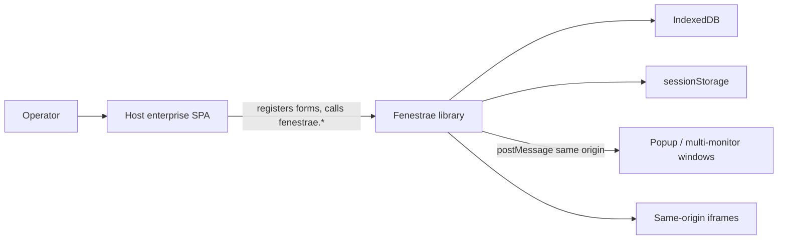
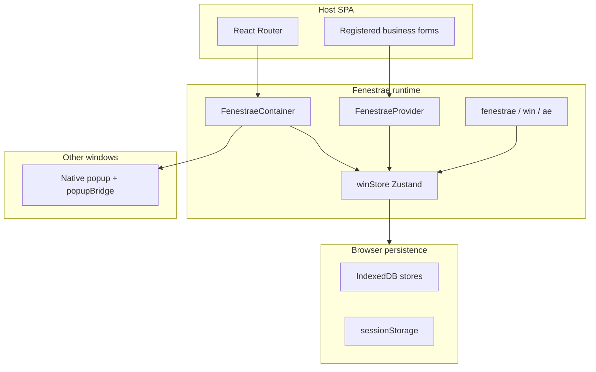
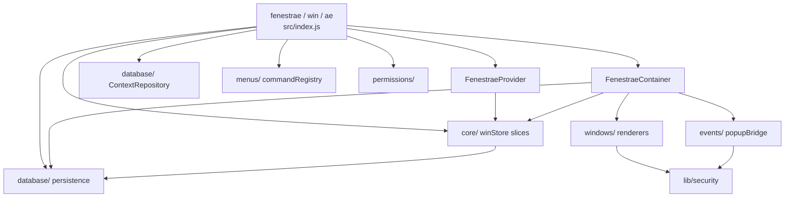

# Architecture

C4-style view of Fenestrae as a **library inside a host SPA**, not as a distributed system. Level 4 (code) is the source tree and [`src/index.d.ts`](../src/index.d.ts); it is not duplicated here.

## Level 1 — System context

Fenestrae does not authenticate users or talk to a server. The host app owns identity and backend access. Fenestrae owns windowing, local session restore, and same-origin communication with popups and iframes.

| Neighbour | Role |
| --- | --- |
| Host SPA | Login, routing, business forms, server APIs |
| IndexedDB | Sessions, windows, per-window context |
| sessionStorage | Current user, workspace, session, permissions |
| Popups | External windows with `window.externalBus` |
| Iframes | Only `http(s)` URLs from the app origin (or `params.allowedOrigins`) |

## Level 2 — Containers (runtime boundaries)

In a library these are processes/stores inside the browser, not deployable services.

1. **Host SPA** — React tree, router, form components.
2. **Fenestrae runtime** — Provider, Container, Zustand `winStore`, imperative API.
3. **Browser persistence** — IndexedDB + `sessionStorage` (not `localStorage`).
4. **External windows** — `window.open` popups with an injected bridge.

F5 keeps `sessionStorage` and IndexedDB, so the workspace comes back. A new tab has its own `sessionStorage` and does not share the operator session.

## Level 3 — Components

Source folders map to the runtime. There is no module named “Workspace Engine”; that behaviour is `core/` + `windows/`.

| Folder | Responsibility |
| --- | --- |
| `src/core/` | Zustand store: lifecycle, layout, focus, openers, registry |
| `src/windows/` | Provider, Container, tab/modal/float/side/top/panel/ext renderers |
| `src/database/` | Sessions, windows, IndexedDB adapters, context repository |
| `src/events/` | Script injected into popups (`externalBus`) |
| `src/lib/security.js` | Trusted iframe URLs, `postMessage` origin, persist sanitization |
| `src/permissions/` | UI-only permission list |
| `src/menus/` | Command registry and `FNMainMenu` |
| `src/themes/` | CSS variable mapping (`modern`, `dark`, `macOS`) |

`winStore` is composed of slices (`lifecycle`, `layout`, `focus`, `api`, `misc`). Persistence does not create windows by itself; the container asks it to restore, then Zustand holds the live tree.

## Persistence rules

- `sessionStorage` holds `fenestrae_user`, `fenestrae_workspace`, `fenestrae_session`, hydration flag, launchpad id, permissions.
- IndexedDB holds users, workspaces, sessions, windows, contexts.
- Composite ids use `::` (`workspace::user`, `session::win::key`).
- Sensitive keys (`password`, `token`, `dni`, …) are stripped before persist.

## What 1.1.x should not invent twice

The Context Manager should sit next to `database/` and `context`, not replace `winStore`. Window geometry and operator session stay here; process context is the missing layer.
